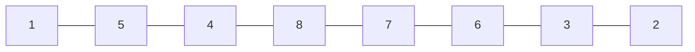
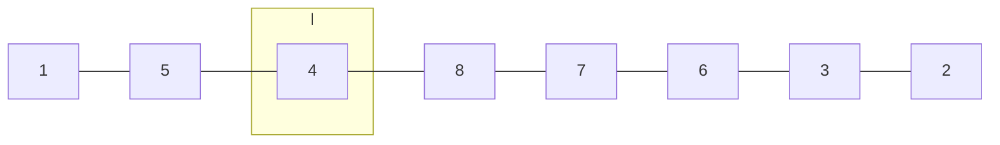
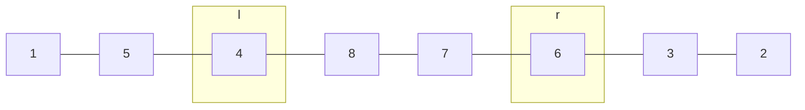
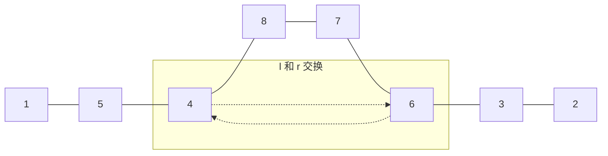
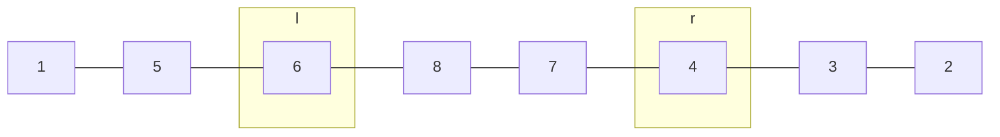
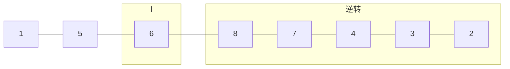
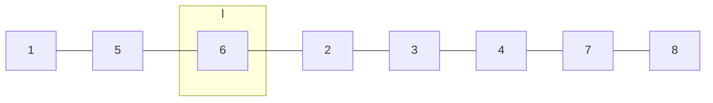

# [题目](https://leetcode.com/problems/next-permutation/)

* Next Permutation

> Implement **next permutation**, which rearranges numbers into the lexicographically next greater permutation of numbers.

> If such arrangement is not possible, it must rearrange it as the lowest possible order (ie, sorted in ascending order).

> The replacement must be in-place and use only constant extra memory.

> Here are some examples. Inputs are in the left-hand column and its corresponding outputs are in the right-hand column.

>    1,2,3 → 1,3,2

>    3,2,1 → 1,2,3

>    1,1,5 → 1,5,1


# 代码

```cpp
class Solution{
public:
    void nextPermutation(vector<int>& nums) {
        if (nums.empty()) return;
        int n = nums.size() - 1;

        // 从右到左找第一个下降的 l
        int l = -1;
        for (int i = n - 1; i >= 0; i--){
            if (nums[i] < nums[i + 1]){
                l = i;
                break;
            }
        }

        if (l == -1){
            // 3,2,1 --> 1,2,3
            reverse(nums, 0, n);
            return;
        }

        // 从右到左找第一个大于 nums[l] 的 r
        int r;
        for (int i = n; i > l; i--){
            if (nums[i] > nums[l]){
                r = i;
                break;
            }
        }

        // 交换 l, r
        swap(nums, l, r);

        // 翻转 l + 1 到结尾的数组
        reverse(nums, l + 1, n);
    }

    void reverse(vector<int>& nums, int i, int j){
        while (i < j){
            swap(nums, i, j);
            i++;
            j--;
        }
    }

    void swap(vector<int>& nums, int i, int j){
        int temp = nums[i];
        nums[i] = nums[j];
        nums[j] = temp;
    }
};
```

# 复杂度

* 时间复杂度: $O(n)$
* 空间复杂度: $O(1)$

# 思路

* 字典序找规律，例如 $nums = [1,5,4,8,7,6,3,2]$


1. 从右往左找**第一个下降**的节点 $l = 4$

2.  从右往左找**第一个大于 $l$ **的节点 $r = 6$

3. 交换 $l$ 节点和 $r$ 节点

得到


4. 逆转 $l + 1$ 后的数组

得到


* 边界情况
  * 若 $l$ 找不到，则说明 $nums$ 从右到左是升序序列，如 $nums = [4,3,2,1]$ ，根据题意直接将 $nums$ 逆转即可。
  * 若 $l$ 能找到，则 $r$ 一定能找到的，因为至少 $nums[l + 1] > nums[l]$。
